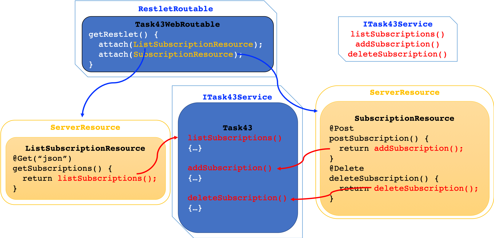

# pdf
- https://docs.google.com/document/d/16rlIwmSmP3yC4BlgtK_izt-25Iqj5b1EXPFMlhHW-3k/edit

# TOD0
- finish task 4.1 for parsing and min/max

# NICE TO HAVE
- task 4.1 could consider to use broadcast ip instead of modifying single IP

# 4.1 – Pub-Sub Routing

- write a "subscriber" application (pref. Python or Java) which receives UDP datagrams containing measurement data and
possibly filters them by measurement type (0 for energy and 1 for power) and value (greater, less or equal to a certain reference value)
    + Subscriber input parameters: 
        - UDP port
        - measurement type
        - comparison operator
        - reference value
        - whether to filter at all
        
- Write a script ~/ex4/task41.sh which install flows for: 
    - ARP broadcast and IP forwarding in the 10.0.0.0/8 network
    - forwarding of measurements (matched by the multicast IP 230.0.0.0/8) to all subscribers
- Compare the size of the unfiltered vs. filtered output
- UDP programming reference: https://www.baeldung.com/udp-in-java
```
java Subscriber 50001 1 500 all gt
java Subscriber 50002 1 100 all gt
java Subscriber 50003 0 30 all st
java Subscriber 50004 0 136 all gt
```
- Runtime.getRuntime().addShutdownHook 使用实例
    + https://blog.csdn.net/HeatDeath/article/details/81668406
- UDP package size: 1500
    + https://juejin.cn/post/6844903638423306253

# 4.2 – Content-based Routing

# 4.3 – REST Interface for Content-based Routing


這題其實可以reduce成 bfs + merge intervals

## Open issue
- 同一個host重複訂閱我們要怎樣處理
    + 不允許重複訂閱（implicitly 只允許

## TODO 完成
- java application http方法調用
- review HTTP and assignment of SoC
- java serialization to json and flow install
# Requirement
- floodlight controller:
    - requirement:
        + POST: parsing all field, record, (generate + install all flows)
        + DELETE: erase all flows, take out the generated new flow, turn them into deleteFlow, and install it
        + GET: return a json file, taking all the subscriptions and serialize it into a JSON file
    - side note:
        + 因為沒有update, 所以我們只需要把整個flow覆蓋掉即可    
- host application:
    - update your subscriber application to use this REST- interface to register subscriptions!
        + java application http方法調用
            + https://github.com/FasterXML/jackson-core/releases
            + http://tutorials.jenkov.com/java-json/jackson-installation.html
            + https://openjdk.java.net/
            + Java使用 curl: https://www.baeldung.com/java-curl
                + https://github.com/eugenp/tutorials/blob/master/core-java-modules/core-java-networking-2/src/test/java/com/baeldung/curltojava/JavaCurlExamplesLiveTest.java
        + optional: java 如何在run的時候得到新的update(多線程調用)
        
- 測試方法：
    + floodlight controller: 透過curl直接運行jason file
    + subscriber application: 要在local先試過能不能reach到local host的content    
    
- Create a package net.sdnlab.ex4.task43 for a Floodlight Module
providing the following REST interface:
- Floodlight Tutorial: https://floodlight.atlassian.net/wiki/spaces/floodlightcontroller/pages/15040589/How+to+add+a+REST+API+to+a+Module
- Floodlight delete flow: https://floodlight.atlassian.net/wiki/spaces/floodlightcontroller/pages/1343547/How+to+use+OpenFlowJ-Loxigen
    +  必須使用delete strict 才不會誤刪
    
```
A side note about "strict": according to OpenFlow specification, the flow modification message and flow deletion message support a "strict" version and a "without strict" version. 
A "strict" means any flow that exactly looks like the match you specify, then the flow(s) will be modified or deleted. 
While if you choose a version "without strict", it means any flow that look like the match you specify 
(i.e. the flow contains at least the match you specify, but could contains more match fields) will be modified or deleted. 

```    
    
- JSON Parser: https://github.com/FasterXML/jackson-databind
- Java 实现 HTTP 请求的三种方式: https://zhuanlan.zhihu.com/p/69285935
# execution step
step1: /opt/floodlight/floodlight-noforwarding.sh
step2: sudo ~/ex4/mininet4.py
step3: sh task43.sh
step4: mininet cmd运行 pingall
step5: 另开一个terminal 输入 wireshark
step6: ctrl+c关掉 /opt/floodlight/floodlight-noforwarding.sh
step7: eclipse 运行task43.launch
step8: mininet 运行 xterm sub1，然后可以curl -X POST -d '{"name":"xxx"}' http://10.10.10.10:8080/subscriptions/sub1/json
stpe9: wireshark監控“s1-eth3", 使用filter "http" (只有透過mininet發送的請求可以在這邊監控到，無法直接監控controller)

```
OFFlowDelete flowDelete = FlowModUtils.toFlowDelete(flowAdd);
```
- Java JSON: http://tutorials.jenkov.com/java-json/index.html
- Add dependency in IntelliJ with .jar: https://www.jetbrains.com/help/idea/working-with-module-dependencies.html#add-a-new-dependency
- Making a JSON POST Request With HttpURLConnection: https://www.baeldung.com/httpurlconnection-post
    + https://github.com/eugenp/tutorials/blob/master/core-java-modules/core-java-networking-2/src/main/java/com/baeldung/urlconnection/PostJSONWithHttpURLConnection.java

# Complexity Anaylsis
- N is number of host
- w/ flow Priority: 
    - Time Complexity: O(NlongN) from sorting
    - Space Complexity: O(1)

- w/o flow priority:
    - 每個訂閱都直接綁定unique port, 每個packet根據subscriber的數量複製一次
    - Space: O(N)
        + argument: 看似可以接受，但如果訂閱者很多就會把bandwith擠爆
    - Time Complexity: O(N)

# Others

```
ssh sdnfp04_proxy

sshfs sdnfp04_proxy:/home/student/ex4 remote_sshfs_ex4

sshfs sdnfp04_proxy:/opt/floodlight/src/main/java/net/sdnlab/ex4 remote_java_ex4

sudo reboot

/opt/floodlight/floodlight-noforwarding.sh
```


- https://medium.com/altcampus/how-to-merge-two-or-multiple-git-repositories-into-one-9f8a5209913f#id_token=eyJhbGciOiJSUzI1NiIsImtpZCI6IjI1MmZjYjk3ZGY1YjZiNGY2ZDFhODg1ZjFlNjNkYzRhOWNkMjMwYzUiLCJ0eXAiOiJKV1QifQ.eyJpc3MiOiJodHRwczovL2FjY291bnRzLmdvb2dsZS5jb20iLCJuYmYiOjE2MTA1NTg4NDcsImF1ZCI6IjIxNjI5NjAzNTgzNC1rMWs2cWUwNjBzMnRwMmEyamFtNGxqZGNtczAwc3R0Zy5hcHBzLmdvb2dsZXVzZXJjb250ZW50LmNvbSIsInN1YiI6IjEwODcyMTYzNTA3OTY4MjM2Nzc2NiIsImVtYWlsIjoia3Vhbmd5dS5sdW1pZXJlLmxpQGdtYWlsLmNvbSIsImVtYWlsX3ZlcmlmaWVkIjp0cnVlLCJhenAiOiIyMTYyOTYwMzU4MzQtazFrNnFlMDYwczJ0cDJhMmphbTRsamRjbXMwMHN0dGcuYXBwcy5nb29nbGV1c2VyY29udGVudC5jb20iLCJuYW1lIjoiS1VBTkctWVUgTEkiLCJwaWN0dXJlIjoiaHR0cHM6Ly9saDMuZ29vZ2xldXNlcmNvbnRlbnQuY29tLy1iLW1RNkpzNVpxSS9BQUFBQUFBQUFBSS9BQUFBQUFBQUFBQS9BTVp1dWNsWEtZb0pvZm9WUkI3SkRJcnJLNUJRblJXdFlBL3M5Ni1jL3Bob3RvLmpwZyIsImdpdmVuX25hbWUiOiJLVUFORy1ZVSIsImZhbWlseV9uYW1lIjoiTEkiLCJpYXQiOjE2MTA1NTkxNDcsImV4cCI6MTYxMDU2Mjc0NywianRpIjoiZjg2Y2E5N2FlMmJkYTI4ZTIwY2Q0YTJhNzM0NjQwOWMxNDFjNmFmYiJ9.A-rlY3t9fEImYYPBmX6qQ_1oJR27DGIgOaSrvE7D37pAbceTytcU9gm8VqKgwv5bJkannqE8AK0mBXB793FU98sukC43Y0llssvyZRaYZvXSAckfaPwHgAJqr49HJOWXha7HKXgdluHBDU0pDqm-xeJtYaGFgiZ-pWQ-xyxiNSgBtQa9tqjjkTZ42Oee62iJ_UEGvoP18wQH4YQbf5HcLMPhDfqqdRAWw8VCtgD4HtLdO4zH_Wz9evDnV73nacD8Q9B5auChkLLivf3DRM3ImfgDZWG2nb19BS9sS_d36GN_EMvtoHjx78KqXtjM7_9TOGJjtWwHk-9zempcK9F0iw
- https://www.jetbrains.com/help/idea/working-with-code-documentation.html#auto-comment
 /** before a declaration and press ⏎
 
 # Curiosity
 - JSON 的確切格式到底是怎麼樣
 - OutputStream, InputStream, Writer這些東西的到底是什麼？
 - UDP實際上的使用
 - HTTP, REST API
    - URI in a POST identifies the resource (i.e. the service) that will handle the enclosed entity